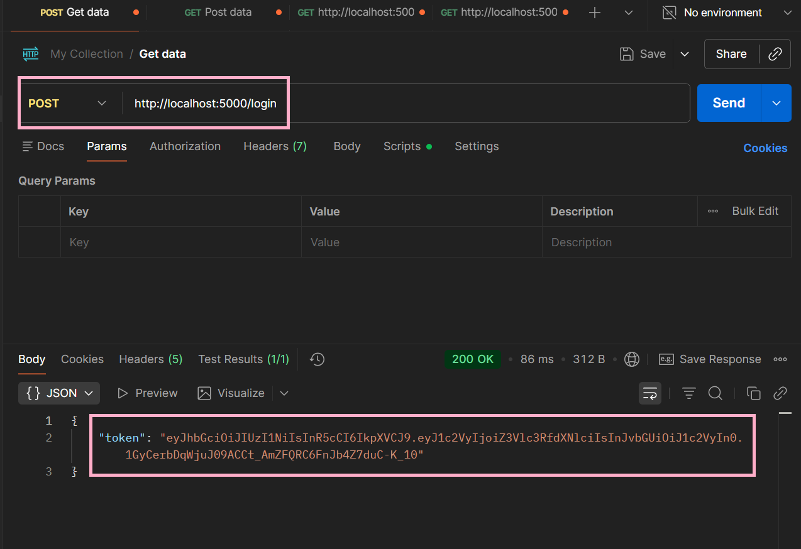
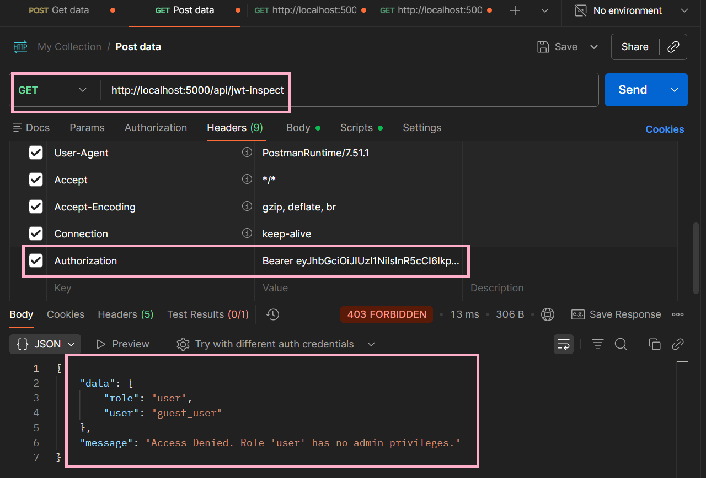
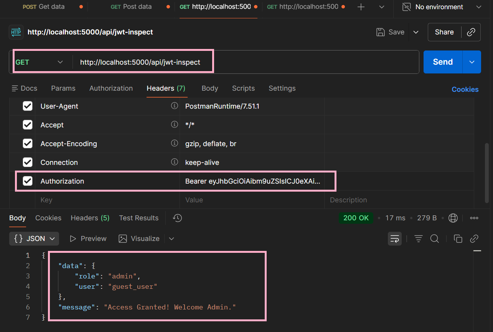
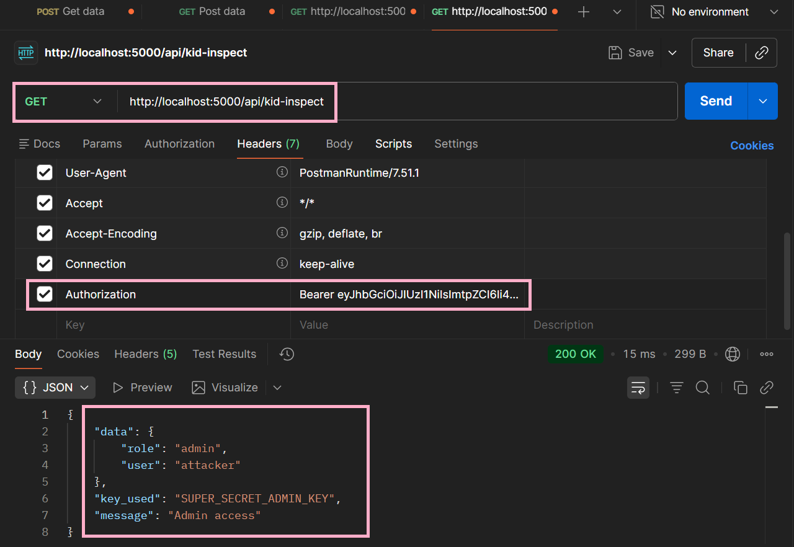

# Exploiting and Mitigating JWT Authentication Vulnerabilities: From Algorithm Confusion to Path Injection

## Project Overview

This project is a Proof of Concept (POC) for a Web Systems Security course, demonstrating two critical classes of JSON Web Token (JWT) implementation vulnerabilities in a Flask-based API:

- **JWT signature bypass via `alg: none` / disabled signature verification**
- **JWT `kid` header abuse via path traversal (path injection)**

The project includes a deliberately vulnerable server and attack scripts that reproduce privilege escalation to administrative access. It also provides mitigation guidance aligned with secure JWT verification practices.

## Educational Purpose and Scope

This repository is intended for **academic, defensive, and laboratory use only**.  
The goal is to understand how insecure JWT validation leads to authentication and authorization bypass, and how to apply secure coding patterns to prevent these issues in production systems.

## Project Structure

- `app.py` - Vulnerable Flask server with:
  - `POST /login` (issues a baseline token)
  - `GET /api/jwt-inspect` (vulnerable JWT inspection flow)
  - `GET /api/kid-inspect` (vulnerable `kid` key-loading flow)
- `forge_token.py` - Generates a forged token using **`alg: none`**.
- `attack_kid.py` - Generates a malicious token with a path-injection payload in the **`kid`** header.
- `secret.txt` - Demonstration key used in the `kid` attack scenario.

## Prerequisites

- **Python** 3.8+ (recommended)
- Python packages:
  - **Flask**
  - **PyJWT**

Install dependencies:

```bash
pip install flask pyjwt
```

## Installation and Running the Server

1. Open a terminal in the project directory.
2. Run the Flask application:

```bash
python app.py
```

3. The server starts on:

```text
http://127.0.0.1:5000
```

## Attack Scenarios and Postman Guide

The workflow below demonstrates both vulnerabilities in a reproducible, step-by-step format.

### 1) Obtain an Initial Token (`/login`)

1. In Postman, create a new request:
   - **Method:** `POST`
   - **URL:** `http://127.0.0.1:5000/login`
2. Send the request (no body required for this POC).
3. Copy the `token` value from the JSON response.

<figure style="text-align:center;">
  
  <figcaption>Initial Authentication and Token Generation (Baseline Scenario): This screenshot demonstrates the baseline authentication flow. A successful HTTP POST request is sent to the /login endpoint. The server authenticates the request and responds with a 200 OK status and a legally generated JWT signed with the server's HS256 secret key.</figcaption>
</figure>

Expected response format:

```json
{
  "token": "<legitimate_hs256_token>"
}
```

<figure style="text-align:center;">
  
  <figcaption>Standard Access Control Enforcement (Pre-Attack State): This screenshot confirms the active enforcement of Role-Based Access Control (RBAC). Using the legitimate JWT, a GET request is sent to /api/jwt-inspect. The server correctly identifies the role as 'user' and returns a 403 Forbidden status, validating that the security mechanism works under normal conditions.</figcaption>
</figure>

### 2) Scenario A - Signature Bypass with `alg: none`

#### Generate malicious token

Run:

```bash
python forge_token.py
```

<figure style="text-align:center;">
  
  <figcaption>Successful Privilege Escalation via Signature Bypass (The Attack): This captures the execution of the POC attack. A forged JWT (alg: none) generated by forge_token.py was used. Since the server failed to cryptographically verify the signature, it accepted the 'role: admin' payload, resulting in a 200 OK status and administrative access.</figcaption>
</figure>

The script prints a forged JWT that contains an **admin role** and no valid signature.

#### Test with Postman

1. Create a new request:
   - **Method:** `GET`
   - **URL:** `http://127.0.0.1:5000/api/jwt-inspect`
2. Add header:
   - `Authorization: Bearer <token_from_forge_token.py>`
3. Send request.

Because the vulnerable endpoint decodes with signature verification disabled, the forged token can be accepted and produce administrative access.

### 3) Scenario B - `kid` Path Injection / Traversal

#### Generate malicious token

Run:

```bash
python attack_kid.py
```

<figure style="text-align:center;">
  
  <figcaption>Exploiting Key ID (KID) Header via Path Traversal Attack: This demonstrates the KID Header Injection. By using attack_kid.py, a malicious token with a path traversal value (..\secret.txt) was crafted. The server processed this untrusted input to locate the signing key, exposing the 'SUPER_SECRET_ADMIN_KEY' and granting admin access.</figcaption>
</figure>

The script creates a JWT whose header includes a malicious `kid` value (for example, `..\secret.txt`) to influence key loading.

#### Test with Postman

1. Create a new request:
   - **Method:** `GET`
   - **URL:** `http://127.0.0.1:5000/api/kid-inspect`
2. Add header:
   - `Authorization: Bearer <token_from_attack_kid.py>`
3. Send request.

In the vulnerable flow, the server trusts `kid`, builds a filesystem path from it, and may read attacker-controlled files as signing keys.

## Results and Expected Responses

### Access Granted (successful bypass)

For `/api/jwt-inspect`, a successful escalation typically returns:

```json
{
  "message": "Access Granted! Welcome Admin.",
  "data": {
    "user": "guest_user",
    "role": "admin"
  }
}
```

For `/api/kid-inspect`, success may return an admin message and parsed token data.

### Access Denied (no privilege escalation)

If role is not admin or verification fails, expected responses include:

```json
{
  "message": "Access Denied. Role 'user' has no admin privileges.",
  "data": {
    "user": "guest_user",
    "role": "user"
  }
}
```

or an error response such as:

```json
{
  "error": "<verification_or_path_error_message>"
}
```

## Mitigation and Secure Implementation Guidance

The vulnerabilities in this POC are caused by unsafe decode logic and untrusted key selection. A secure implementation should enforce the following controls:

- **Always verify signatures** (never disable `verify_signature` in production).
- **Strictly enforce expected algorithms** (for example, allow only `HS256` if that is your design).
- **Do not accept `alg: none`**.
- **Do not derive key file paths directly from untrusted `kid` input**.
- **Use a trusted key registry/map** from known `kid` values to predefined keys.
- **Reject unknown `kid` values** and log security events.

### Example: safer JWT decode pattern

```python
decoded = jwt.decode(
    token,
    SECRET_KEY,
    algorithms=["HS256"],   # strict allow-list
    options={"verify_signature": True}
)
```

For `kid`-based systems, replace file path construction from user input with a controlled lookup:

```python
KEYS = {
    "main-key-1": "SUPER_SECRET_ADMIN_KEY"
}

kid = jwt.get_unverified_header(token).get("kid")
if kid not in KEYS:
    raise ValueError("Unknown key identifier")

decoded = jwt.decode(token, KEYS[kid], algorithms=["HS256"])
```

## Conclusion

This POC demonstrates how small JWT validation mistakes can produce severe authentication and authorization failures.  
Applying strict algorithm enforcement, mandatory signature verification, and trusted key management effectively mitigates these attacks.

